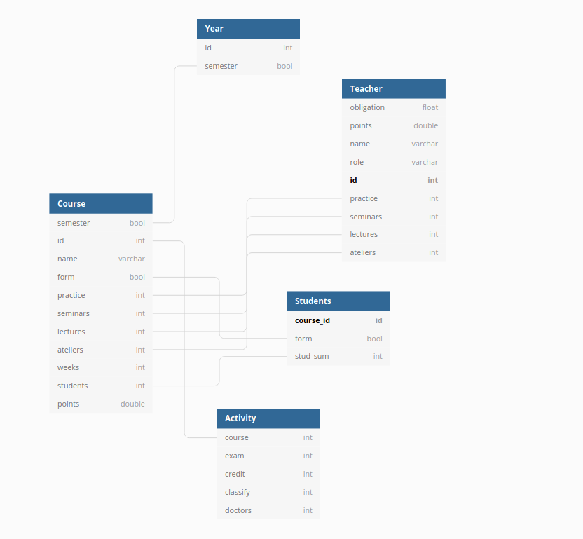

# AP8PO

Projekt do předmětu pokročilé programování - dashboard pro tajemníka

# Technologie

**Tohle jsem přehodnotil**

> :warning:Webové UI bude postavené na balíkovacím systému **npm** s tím, že se budu snažit využít **REACT**, nebo **Angular**
> Databázi pravděpodobně budu řešit přes [node-json-db](https://www.npmjs.com/package/node-json-db).

**Použiju Python, protože v něm celkem často píšu**

#### Motivace, proč jsem se rozhodl použít tyto technologie

> :warning: 
> 
> - Chtěl jsem se naučit trochu víc s **npm**
> - Protože jsem stavěl svůj web na **Vuetify**, tak jsem si chtěl zkusit i něco jiného, tím je **Angular** a **React**- jedno z toho si vyberu...
> - Mám rád JSON a jeho export do čehokoliv dalšího
> - Čekám od předmětu asi to, že mě posune hlavně ve věcech, kterým se chci věnovat a nebude mě zbytečně ničit

**Po svých posledních seancích s webapps jsem se rozhodl se tohle neučit, protože mě z toho jenom bolí hlava, fakt reálně tohle není můj šálek kávy. Mám rád hardware, Cčko, pentesty a hacking. Frontend a web technologie nechávám lidem, co je to baví :blush:**

# Návrh DB

1. Bude DB předmětů a učitelů
2. Bude ROLES-RULES-POINTS TABLE, kde budou rozhozene bodu za akademicke achievmenty

## Weekend crush (techno <3 RedBull :blush: )

### Co jsem stihl:

- GUI

- Moc commitů

- Práce s databázema v JSONu

- Tahání dat z databází do GUI (není to kompletní)

- Connections v GUI

- Promyslet si, jak na to jít dál

- Switch z Angular/React technologií do **Pythonu** a **PyQt5**

### Co jsem nestihl:

- Odesílání e-mailů

- Hledání v databázi podle pre/su - ffixu

- Dropdown

- Generování prac. štítků (optat se, jak na to)

- Pooling štítků (tady mi fantazie trochu kulhá - jak na to jít)

- Automatizace

- Přepočítání

- Mimořádné štítky (přidám attr - info *nebo tak něco*)

- Convert 

### Jak to vypadá?

#### Pracovní štítek:

- Dynamicky volí velikost sloupců podle nejdelšího textu

- Plánuju přidat a odebrat řádek - promítne se přímo do databáze

#### Zaměstnanci

- Víceméně stejné funkcionality, jak jsou u štítků

- Ještě se automaticky nepočítají body

- Cross-connection databazi dopisu asi v neděli

#### Předměty:

- Checkval doplnim - default hodnota u kapacity např.

- Jinak opět funkcionalita stejná, jak u zbytku (přidat/odebrat)

#### Skupiny:

- Zatim jsem je jen narychlo generoval, opět všechno dynamicky generované

#### JSON data

- Na vytváření používám **TinyDB**

- JSON má sice svoje bolesti, ale v Pythonu je to prostě jednoduchá věc

- Dobrý convert do **.csv** což bych rád využil pak v odesílání do mejlu

- Databáze mám krom *bodového systému* všechny -> App/DBs

# Problémy

Na startu jsem si vybral blbě technologie a pak se mi nechtělo nic dělat. V Py jsem schopný to nabouchat snad velice rychle a pak ladit jen funkcionalitu. Tak v pondeli uvidime, ale vyhradil jsem si na to nekolik dni + rush o vikendu.

> bmVtdXNpbSBieXQgemEgdG90YWxuaWhvIGRlbWVudGE= 

# Dotazy

- Jak na štítky... jako tušim a asi jsem si to nějak vyjasnil, ale prostě mě tohle nějak furt nejde na/pod jazyk

- Generování? Vůbec nevím, jak si tady s tím poradit, jestli nějaké connection, nebo další DB, kde by se zapisovaly propojení a kontrolovaly se s úvazkem a bodama... ?
